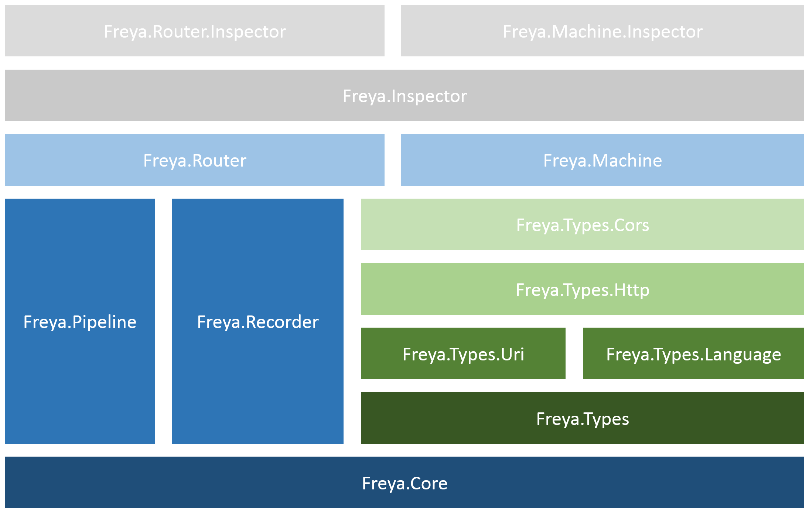

- title : Freya
- description : A functional-first web stack in F#
- author : Andrew Cherry (@kolektiv) and Ryan Riley (@panesofglass)
- theme : night
- transition : default

***

# Freya

## A functional-first web stack in F#

Andrew Cherry (@kolektiv)

Ryan Riley (@panesofglass)

***

## (Optimistic) Contents

* Introduction (5 mins)
* [OWIN](http://owin.org/) (5 mins)
* Freya Stack (10 mins)
  * Tour
  * Lenses
* Todo Backend - Review (10 mins)
* Static File Server - Walkthrough (10 mins)
* Next / Questions (? mins)

***

# Introduction

General Rambling

***

## Who?

* Andrew Cherry ([@kolektiv](https://twitter.com/kolektiv))
* Ryan Riley ([@panesofglass](https://twitter.com/panesofglass))
* ... others? Collaboration is welcome!

***

## Ecosystem (F# Web)

* [WebSharper](http://websharper.com/)
* [Suave](http://suave.io/)
* [Frank](http://frankfs.net/)
* [Taliesin](https://github.com/frank-fs/taliesin)
* [Dyfrig](https://github.com/panesofglass/dyfrig)
* [other projects usable from F#, but implemented in "something else"]
* [other projects I've forgotten / not found]

***

## History

* **2010 - Frank** - combinator library using `System.Net.Http` types
* **2013 - Dyfrig** - initial F# OWIN helpers, eventually became a small library
* **2013 - Taliesin** - OWIN routing middleware
* **2014 - Frost** - experiments in "machine" style web processing in F#
* ...
* **2015 - Freya**

***

## Naming

* Dyfrig
* Taliesin
* ...
* Common theme -- names that nobody can pronounce
* Alternative spelling "Freyja" rejected due to increasing self-awareness

***

# OWIN

Integration with existing standards, when possible

***

## [OWIN](http://owin.org/)

* Standard contract between servers and apps/frameworks
* Several server implementations, including IIS
* Low-level
* Lowest common denominator
* Reasonably well followed standard

***

## OWIN Design

* OWIN design is very simple for historically meaningful (and not crazy) reasons
* All based on mutation and side effects, thus
* Not functional
* Uses simple types and works with any .NET language

***

## OWIN Design

* `Task`s (not `Task<T>`)
* Dictionary of state (`IDictionary<string, obj>`)
* Defined keys contain boxed objects of known types (some keys are optional)
* E.g., request headers are "owin.RequestHeaders" defined as an `IDictionary<string, string[]>`
* Includes rules governing side effects in some cases

***

## OWIN Design

* Servers should take action when certain elements in the environment dictionary change
* E.g., writing to the body stream, "owin.ResponseBody" typed as `System.IO.Stream`, flushes the headers, and you should no longer be able to write headers
* This design makes life difficult from the perspective of functional purity

***

# Freya Stack

A Tour

***

## Freya Architectural Principles

* Build a stack rather than a monolithic framework
* Aim to make it easy to take components up to any level, and find them useful
* Aim to create a stack which is useful, but also a good set of building blocks for higher level abstractions
* Aim to make compatibility with non-Freya code simple (through adapters, mapping functions, etc. where sane)

***

## Freya "Ethical" Principles

* Don't hide/smother existing abstractions
* HTTP is already a solid and well known abstraction -- work with if not against it
* Make it easy/trivial to do the right thing, and use the strengths of F# to make it hard/impossible to do the wrong thing

***

***

## `Freya.Core`

* Basic abstractions over OWIN
* `freya` computation expression (the wrapping abstraction for our mutable state -- we will never speak of this in polite conversation)
* Set of operators to use `freya` computation expressions in a more concise way
* Some basic functions and **lenses** to give access to the state in a controllable way

***

# Lenses?

Quick glance at Lenses in code (if needed) ...

***

## `Freya.Pipeline`

* Very small and simple -- all about composing `freya` computations in a way that represents a continue/halt processing pipeline
* A pipeline is simply a `freya` computation that returns `Next` or `Halt` (`FreyaPipelineChoice` cases)
* Single, simple operator: `>?=`
* If the pipeline returns `Next`, it will run the pipeline on the right, otherwise it will `Halt`

***

## `Freya.Recorder`

* Build introspection into the framework at a low level
* Provide some infrastructure for recording metadata about processing that more specific implemenations can use
* For example, `Freya.Machine` records the execution process so it can be examined later

***

## `Freya.Types.*`

* Set of libraries providing F# types which map (very closely) to various specifications, such as HTTP, URI, LanguageTag, etc.
* These are used throughout the higher level stack projects
* Always favor strongly-typed representations of data over strings
* Provides parsers, formatters (statically on the types) and lenses from state to that type (either total or partial)

***

## Really?

* Why not use `System.Net.Whatever`?
* Well ...

***

***

## `Freya.Types.*`

* Types and parsers for when you don't already know everything about the string you've been given
* Types which map closely to HTTP specifications
* Types which can distinguish between different kinds of URIs being valid in different places
* Types which can actually express languages that aren't "en-US"
* ("hy-Latn-IT-arevela"? Of course we support Aremenian with a Latin script as spoken in Northern Italy why do you ask?)

***

## `Freya.Router`

* A simple, trie-based router, does pretty much what you'd expect
* Has a cute computation expression syntax (`freyaRouter`)
* Doesn't try and do anything but route requests to pipelines
* (and is itself a pipeline -- everything's composable / nestable!)

***

## `Freya.Machine`

* A "machine" style resource definition / processing library
* Inspired by projects like web machine (Erlang) and Liberator (Clojure) but adding an F# twist (hint -- it's types again)
* Also has a cute computation expression syntax -- `freyaMachine` (or a terrible perversion of the point of CEs, depending on perspective)

***

## Machine Style Frameworks?

* Every resource can essentially be modeled as a graph, or state machine, of how to respond to a request
* That graph can be configured by choosing to override certain aspects of it (decisions, handlers, etc.)
* Each resource is therefore the default graph, plus a set of overrides (and thus is a more "declarative" way of specifying how a resource should behave)
* Shall we look at the graph? Oh, go on then ...

***

## Look at the Pretty Graph

***

## `Freya.Inspector`

* Front-end to built-in introspection
* Has an extensibility model (well, half of one -- the very definition of "alpha" right now) allowing components to display component-specific data in suitable ways
* Right now provides an API; UI in-progress

***

## `Freya.*.Inspector`

* Component-specific extensions to the inspector, currently providing component specific JSON for the inspects
ion API
* Will provide UI extensions, too, but I haven't decided on the best approach to that (suggestions welcome, of course)

***

## Look at the Freya Source

***

# Todo Backend

Review

***

## Todo Backend

* A standard, simple "thing" to implement to help compare approaches
* Inspired by TodoMVC, for comparing front-end frameworks
* Here: http://todobackend.com/

***

## Look at the Todo Backend Source

***

# Static File Server

Walkthrough

***

## Static File Server

* How do you approach building something using `Freya.*`?
* Let's build a tiny little static file server and see how to extend it (if we have time)

***

## Build a Static File Server

***

## Next for Freya

* Full release! Very soon ...
* Inspectors / UI - in progress
* Documentation - also very soon!
* http://github.com/freya-fs/freya

***

# Questions?
